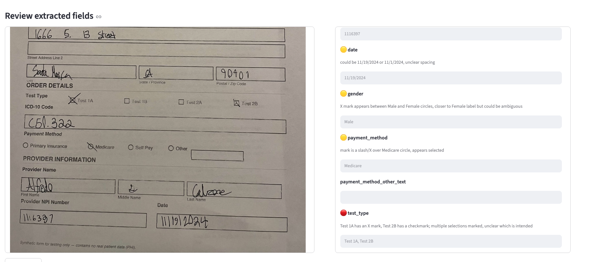

# FormScan AI

https://formscan.streamlit.app/

Turn a photo of a handwritten medical order form into structured data and, crucially, **flag the fields the system isn't sure about** so a human can verify them before the data is trusted.

Most OCR tools hand you a transcription and leave you to spot the mistakes. FormScan instead scores its confidence field-by-field and routes only the uncertain values to a human reviewer, because in a healthcare context a silent misread means a patient outreach and a delay in care.

> **Synthetic data only.** All forms are fabricated for testing. No real patient data (PHI) is used, and any resemblance to real people is coincidental.

## Demo



The reviewer sees the form and the extracted fields side by side. Uncertain fields are flagged with a confidence level 🟡 (medium) or 🔴 (low) with the reason for doubt, and can be corrected inline.

## How it works

1. **Extraction** * the form image is sent to a vision LLM (Claude) along with the form's known field schema, so the model focuses on reading handwriting rather than re-deriving the layout.
2. **Confidence scoring** * the model returns each field with a value, a confidence level, and a note explaining any ambiguity. It is deliberately biased toward flagging, since a missed error is costlier than an extra review.
3. **Structured output** * results are returned via a tool-use schema, so the output is validated and reliable rather than hand-parsed text.
4. **Human-in-the-loop review** * a Streamlit UI shows the form beside its fields, highlights the uncertain ones, and lets a reviewer confirm or correct each value.

## Tech stack

- **Python**, **Claude vision API** (structured output via tool use)
- **Streamlit** for the review interface
- **Pillow** for image validation

## Running it locally

```bash
# 1. Create and activate a virtual environment
python3 -m venv venv
source venv/bin/activate        # Windows: venv\Scripts\activate

# 2. Install dependencies
pip install -r requirements.txt

# 3. Add your Anthropic API key
cp .env.example .env            # then edit .env and paste your key

# 4. Run the app
streamlit run app.py
```

You can also run extraction from the command line:

```bash
python extract.py path/to/form.jpg
```

## Roadmap

- **Learning loop (planned):** store human corrections in a FAISS vector store and retrieve similar past corrections as context on future forms, so recognition of recurring ambiguous handwriting improves over time.
- **On-image highlighting:** overlay confidence flags directly on the form image (requires photo de-skewing and bounding-box detection).
- **Structured choice fields:** render checkboxes/radios as real controls instead of text.

## Security notes

- Uploads are validated by size and by actual image content (not just file extension), enforced at both the app and server-config layers.
- Extracted values are rendered as plain text, never as raw HTML.
- API keys are loaded from a gitignored `.env` and never committed.
